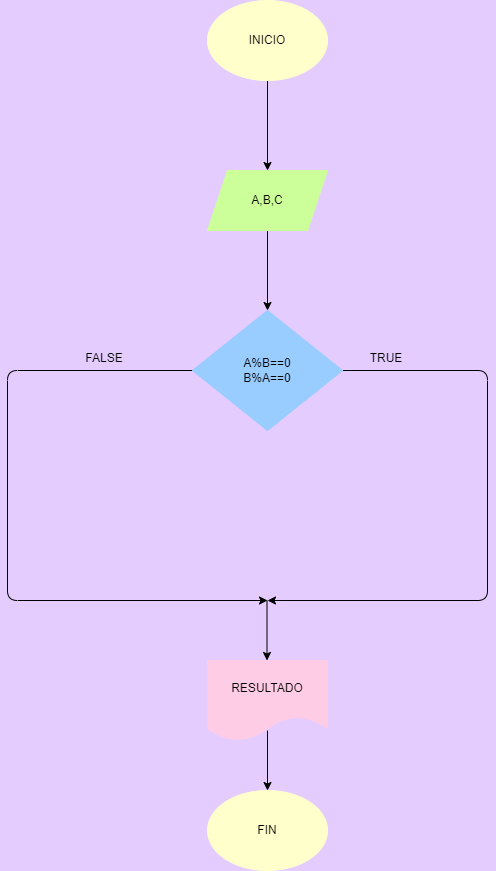

# Leer 2 numeros y averiguar si el uno es múltiplo del otro.

Programa que lea dos números enteros y averigüe si el uno es múltiplo del otro.

# ANALISIS

Variables de Entrada (INPUT) 

A = 1 numero 

B = 2 numero

Variables de Proceso (PROCESSING)

A % B = 0 : Se realiza para saber si el resultado dado es 0 y si es asi son multiplos.

Variables de salida (output)

 Da a conocer si son multiplos del otro o no

# DISEÑO

# CONSTRUCCION