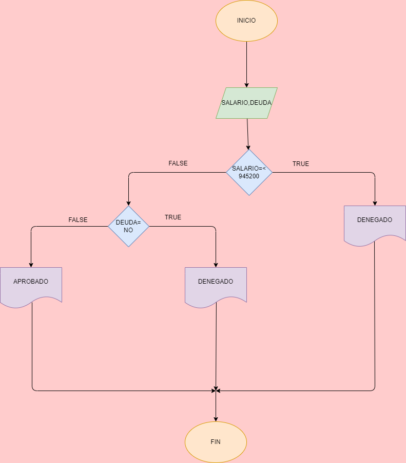

# Prestamo Bancario
Programa para saber si usted puede adquirir un prestamo en el banco segun su ingreso mensual y si tiene deudas anteriores o presentes

# ANALISIS

Variables de entrada (input)

Ingreso mensual = el dinero nesesario para adquirir el prestamo

Deuda = saber si tiene deudas anteriores o presentes

variables de proceso (processing)

Ingreso mensual>= numero ingresado

Deuda = si o no tienes deudas

Variables de salida (output)

Aceptado = Elegible para el prestamo

Denegado = No cumple con los requisitos para adquirir el prestamo

Nos indicara si es elegible o no cumple con lo requisitos para el prestamo

# DISEÑO

# CONSTRUCCION
