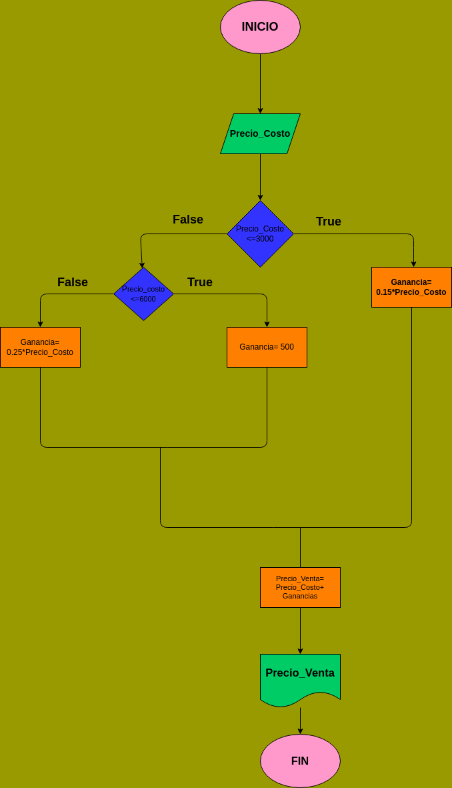

# PRECIO DE UN PRODUCTO

Programa que indica el precio de venta de un articulo dado.

# ANALISIS 

Variable de entrada (input) 

Precio_costo= Precio al que se  compra el producto 

Variables de proceso (Processing)

Ganancia= Porcentaje de rentabilidad de cada producto

Precio_venta= Precio al que se vende el produccto

Precio_venta= Precio_costo+Ganancia 

Ganancia=

15% del precio_costo si es <3000 

$500 si precio_costo es [3000,6000] 

25% del precio_costo si es >6000 

# DISEÑO 

# construccion

