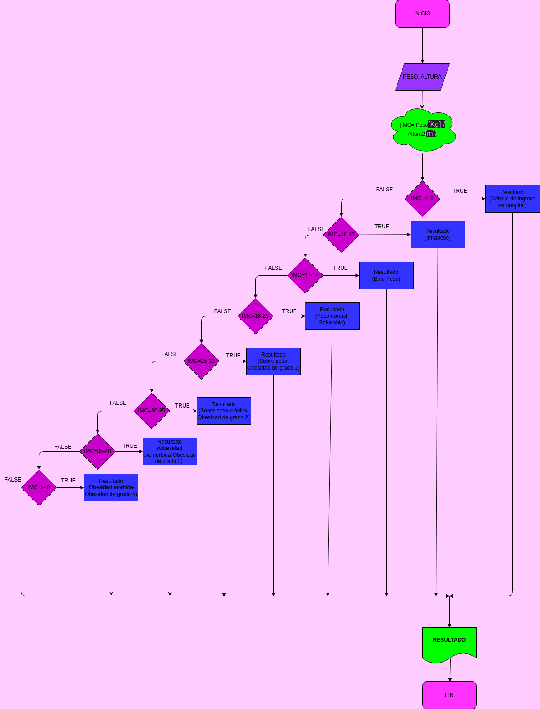

# MASA CORPORAL

Programa para saber su masa corporal de acuerdo a su peso y altura

# ANALISIS

Variables de entrada (Input)

PESO = Su peso ingresado 

ALTURA = Su altura ingresada

Variables de proceso (Processing)

RESULTADOS = Son los resultados de su indice de peso

Variables de salida (Output)

IMC Y RESULTADOS = sResultado de su indice de peso y el resultado de estos

# DISEÑO

# CONSTRUCCION