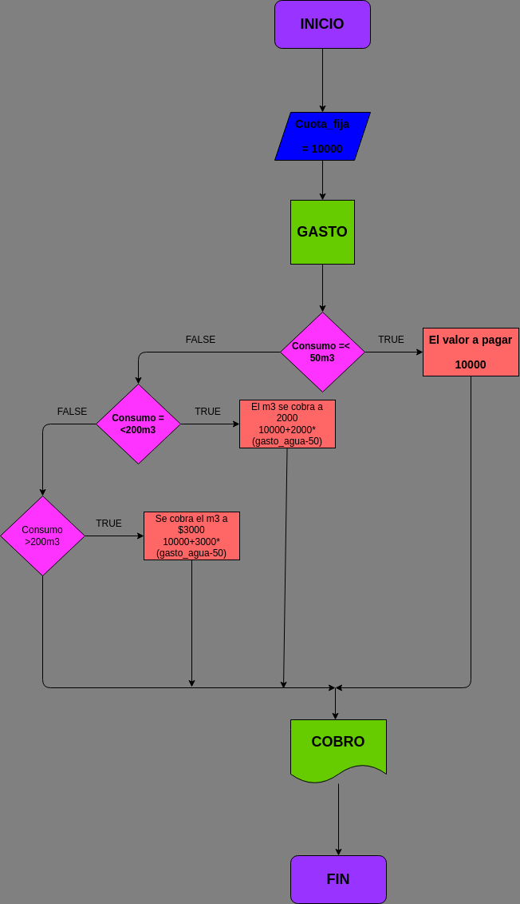

# Gasto de agua en una vivienda en m3

 Progrma para calcular el gasto de agua de una vivienda dado el número de m3 de agua gastados

# ANALISIS

Variables de entrada (Input)

Cuota_fija= Precio que cobra la empresa por el agua

Gasto_M3= Consumo del agua de la vivienda en m3

Variable de proceso (Processing)

Cobro: Precio que cobra la empresa + consumo del agua de la vivienda en m3

Variable de salida (Output)

Cobro= Se muestra cuanto debe ser elpago por el consumo del agua

# DISEÑO

# CONSTRUCCION