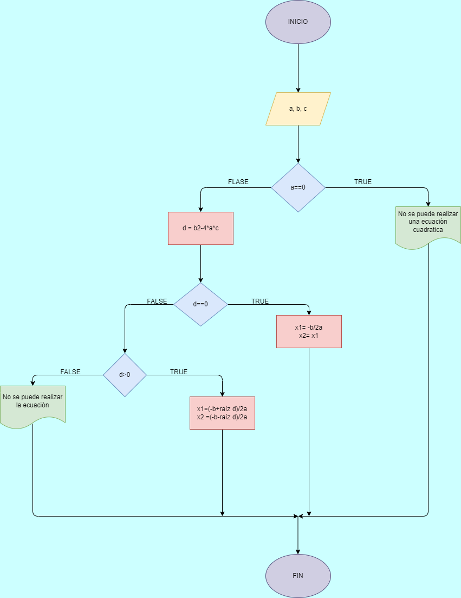

# Raices de ecuaciones de segundo grado

## Programa para calcular e imprimir las raíces de la ecuación de segundo grado de coeficientes reales

# ANALISIS

Variables de entrada 

a = Variable de numero 1 

b = Variable de numero 2 

c = Variable de numero 3

Variables de proceso

d = Varible en la que se hace la operacion para saber si son numeros reales posibles

Variables de salida

 x1 = la 1 variable de salida de los 3 numeros
 
 x2 = la 2 variable de salida de los 3 numeros

# DISEÑO

# CONSTRUCCION