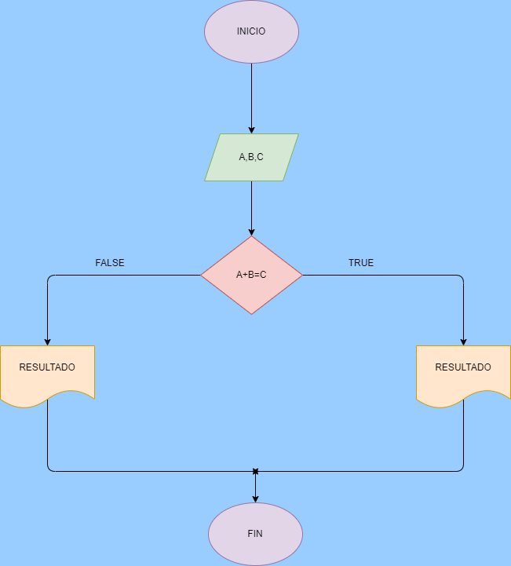

# Suma de los 3 numeros enteros

Programa para saber si la sumatoria de los numeros 1 y 2 es igual al numero 3

# ANALISIS

Variables de Entrada (OUPUT)

A = 1 numero 

B = 2 numero 

C = 3 numero

Variables de Proceso (PROCESSING)

A + B = C 

C= la sumatoria de los 2 primeros numeros da como resultado  el numero  3

Variables de Salida (OUTPUT)

Muestra si la sumatoria de los 2 primeros numeros da como el resultado del numero 3ç

# DISEÑO

# CONSTRUCCION